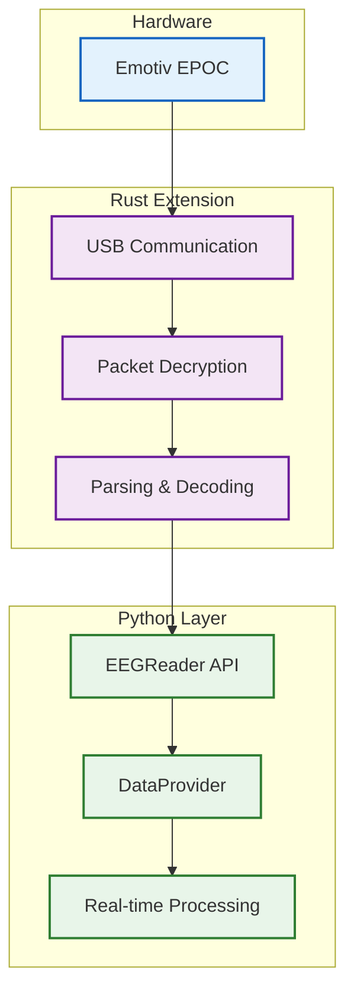

# EEG Data Flow: Hardware → Rust → Python

## Data Flow Overview

### 1. Hardware Layer (Emotiv EPOC)
- **14 EEG channels** + gyroscope + battery + signal quality
- **128 Hz sampling rate**
- **USB HID interface** with encrypted packets

### 2. Rust Extension (Low-level Processing)
- **HID Driver**: Raw USB communication with headset
- **AES Decryption**: Decrypts encrypted 32-byte packets using device-specific keys
- **Packet Parser**: Extracts sensor values, battery level, signal quality from decrypted data

### 3. Python Layer (High-level API)
- **EEGReader**: Clean Python API wrapping the Rust extension
- **DataProvider**: Threaded buffer for continuous real-time streaming
- **BCI Scenes**: Calibration, driving, live prediction scenes consume the data stream

## Key Benefits

- **Performance**: Rust handles low-level operations efficiently
- **Safety**: Memory-safe implementation with no buffer overflows
- **Real-time**: Continuous 128 Hz data streaming
- **Reliability**: Robust error handling and packet validation
- **Python Integration**: Seamless PyO3 binding for Python usage

## Technical Details

- **Packet Size**: 32 bytes encrypted → 26 bytes decrypted
- **Sensors**: 14 EEG channels (F3, FC6, P7, T8, F7, F8, T7, P8, AF4, F4, AF3, O2, O1, FC5)
- **Data Types**: 14-bit EEG values, signed gyro values, battery percentage, quality ratings
- **Threading**: Separate thread for continuous data acquisition
