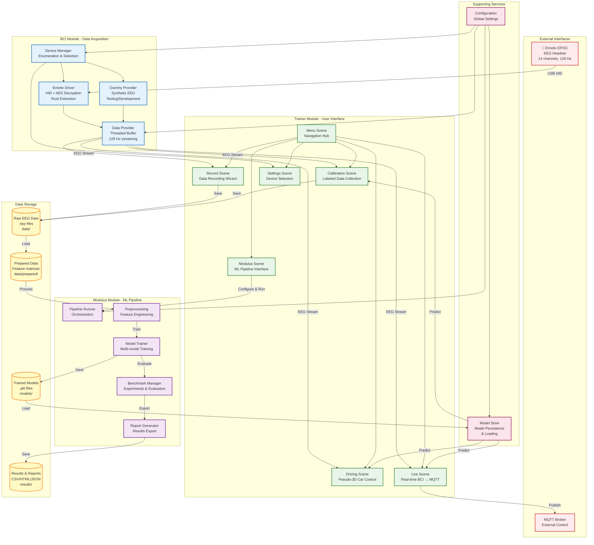

# Cogniflow High-Level Architecture Diagram

This diagram shows the high-level system architecture of Cogniflow, illustrating the main components and data flow.



## System Overview

Cogniflow is a Brain-Computer Interface (BCI) training and control system with an integrated machine learning pipeline. The architecture consists of three main modules:

### 1. BCI Module - Data Acquisition Layer
- **Purpose**: Acquire EEG data from hardware or generate synthetic data
- **Components**:
  - **Device Manager**: Enumerates and manages available devices (Emotiv EPOC, Dummy)
  - **Data Provider**: Threaded buffer providing continuous EEG stream at 128 Hz
  - **Emotiv Driver**: Low-level HID interface with AES decryption (Rust extension)
  - **Dummy Provider**: Synthetic EEG generator for testing without hardware

### 2. Trainer Module - User Interface Layer
- **Purpose**: Pygame-based interactive scenes for BCI training and control
- **Scenes**:
  - **Menu**: Navigation hub and system status
  - **Calibration**: Collect labeled EEG data for training
  - **Record**: Wizard for recording raw EEG data per direction
  - **Driving**: Pseudo-3D car control using BCI or arrow keys
  - **Live**: Real-time BCI predictions published to MQTT
  - **Settings**: Device selection and configuration
  - **Modulus**: ML pipeline interface for experiments

### 3. Modulus Module - ML Pipeline Layer
- **Purpose**: Machine learning workflow for EEG data analysis
- **Components**:
  - **Pipeline Runner**: Orchestrates the entire ML workflow
  - **Preprocessing**: Feature engineering and signal processing
  - **Model Trainer**: Trains multiple ML models (SVM, RandomForest, etc.)
  - **Benchmark Manager**: Runs experiments and evaluates models
  - **Report Generator**: Exports results in multiple formats

## Data Flow

### 1. Data Acquisition Flow
```
Emotiv EPOC → Emotiv Driver → Data Provider → Scenes
Dummy Device → Dummy Provider → Data Provider → Scenes
```

### 2. Recording Flow
```
Record/Calibration Scene → Raw EEG Data (.npy) → data/
```

### 3. ML Pipeline Flow
```
Raw Data → Prepared Data → Preprocessing → Training → Evaluation → Results
```

### 4. Model Usage Flow
```
Trained Models → Model Store → Driving/Live/Calibration Scenes → Predictions
```

### 5. Real-time Control Flow
```
Live Scene → BCI Predictions → MQTT Broker → External Devices
```

## Storage

- **Raw Data** (`data/`): Recorded EEG windows per direction
- **Prepared Data** (`data/prepared/`): Feature matrices ready for ML
- **Models** (`models/`): Trained ML models (.pkl files)
- **Results** (`results/`): Experiment results and reports (CSV/HTML/JSON)

## Key Features

- **Multi-device Support**: Real Emotiv EPOC or synthetic dummy device
- **MVC Architecture**: Clean separation in Trainer module scenes
- **Clean Architecture**: Modulus module follows domain-driven design
- **Real-time Processing**: Threaded data providers for continuous streaming
- **ML Integration**: Seamless workflow from recording to model deployment
- **External Control**: MQTT integration for controlling external devices

## Integration Points

1. **BCI ↔ Trainer**: Data Provider supplies EEG stream to all scenes
2. **Trainer ↔ Modulus**: ModulusScene provides UI for ML pipeline
3. **Modulus ↔ Storage**: Pipeline reads/writes data and models
4. **Trainer ↔ Storage**: Scenes load models and save recordings
5. **Live ↔ MQTT**: Real-time predictions published to external systems

