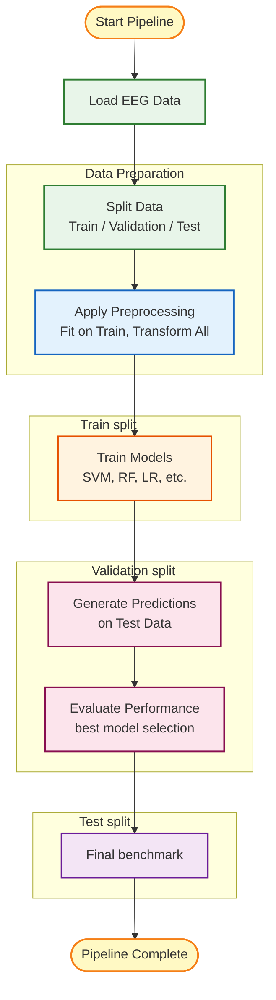

# Modulus ML Pipeline Flowchart

## Modulus Pipeline Steps

### 1. **Load EEG Data**
- Reads recorded EEG data from `.npy` files in `data/` directory
- Merges features and labels from multiple recording sessions
- Creates unified dataset for training

### 2. **Split Data**
- Divides data into Train/Validation/Test sets
- Supports multiple split ratios (70/15/15, 80/10/10)
- Ensures stratified sampling for balanced classes

### 3. **Apply Preprocessing**
- Feature scaling (StandardScaler, etc.)
- Dimensionality reduction (PCA)
- Custom preprocessing pipelines
- Fit on training data, transform all splits

### 4. **Train Models**
- Multiple algorithms: SVM, Random Forest, Logistic Regression, etc.
- Hyperparameter optimization (optional)
- Cross-validation for robust training
- Parallel training for efficiency

### 5. **Generate Predictions**
- Apply trained models to test data
- Generate both predictions and probabilities
- Handle multi-class classification

### 6. **Evaluate Performance**
- Calculate metrics: Accuracy, Precision, Recall, F1-Score
- Confusion matrices and detailed statistics
- Per-class and overall performance

### 7. **Rank Models**
- Compare all models by primary metric
- Sort by performance for easy selection
- Identify best-performing configuration

### 8. **Export Results**
- Save results in multiple formats:
  - **CSV**: Tabular data for analysis
  - **JSON**: Structured data for APIs
  - **HTML**: Human-readable reports with charts
- Store in `results/` directory with timestamps

## Key Features

- **Automated Workflow**: End-to-end pipeline with no manual intervention
- **Multiple Configurations**: Tests different preprocessing and model combinations
- **Robust Evaluation**: Cross-validation and multiple metrics
- **Flexible Output**: Results in formats suitable for different use cases
- **Integration Ready**: Models saved for direct use in Cogniflow driving scenes
