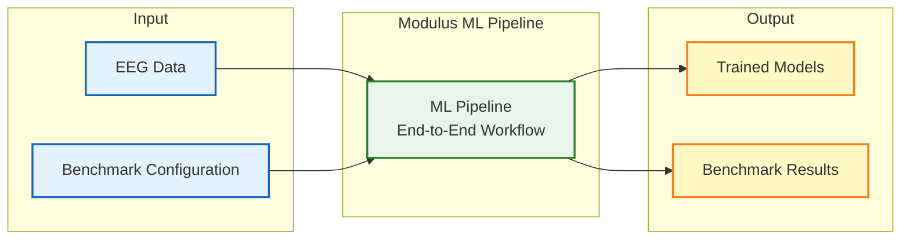

# Modulus High-Level Architecture

## What Modulus Does

Modulus is Cogniflow's **machine learning pipeline** that processes EEG data to train BCI models.

### Input
- **EEG Data**: Recorded brain signals from Cogniflow's data collection scenes
- **Configuration**: YAML files specifying preprocessing, models, and evaluation settings

### Processing
- **Clean Architecture**: 4-layer design ensuring maintainability and testability
- **End-to-End Workflow**: Data loading → preprocessing → training → evaluation → reporting

### Output
- **Trained Models**: Ready for use in Cogniflow's driving and live prediction scenes
- **Benchmark Results**: Comprehensive evaluation metrics and comparisons

### Key Features

- **Multiple Models**: Trains SVM, Random Forest, Logistic Regression, etc.
- **Preprocessing**: Scaling, PCA, feature engineering pipelines
- **Evaluation**: Cross-validation, multiple metrics, model ranking
- **Extensible**: Easy to add new data formats, models, or preprocessing steps
- **Integrated**: Seamlessly works with Cogniflow's data and model storage
