# Cogniflow MVC Architecture Diagram

This diagram shows the overall Model-View-Controller (MVC) architecture of the Cogniflow project.

```mermaid
graph TB
    subgraph "Entry Point"
        MAIN[main.py]
    end

    subgraph "Trainer Module - MVC Scenes"
        direction TB
        
        subgraph "Base Scene"
            BASE[BaseScene<br/>Common functionality]
        end
        
        subgraph "Menu Scene"
            MENU_M[MenuModel<br/>State & Navigation]
            MENU_V[MenuView<br/>Rendering]
            MENU_C[MenuController<br/>Input Handling]
            MENU[MenuScene]
        end
        
        subgraph "Calibration Scene"
            CAL_M[CalibrationModel<br/>Trial Data & Labels]
            CAL_V[CalibrationView<br/>Visual Feedback]
            CAL_C[CalibrationController<br/>Trial Management]
            CAL[CalibrationScene]
        end
        
        subgraph "Record Scene"
            REC_M[RecordModel<br/>Recording State]
            REC_V[RecordView<br/>Recording UI]
            REC_C[RecordController<br/>Record Control]
            REC[RecordScene]
        end
        
        subgraph "Driving Scene"
            DRIVING[DrivingScene<br/>Pseudo-3D Car Control]
        end
        
        subgraph "Live Scene"
            LIVE_M[LiveModel<br/>Live Prediction State]
            LIVE_V[LiveView<br/>Live Visualization]
            LIVE_C[LiveController<br/>Prediction Control]
            LIVE[LiveScene]
        end
        
        subgraph "Modulus Scene"
            MOD_M[ModulusModel<br/>Experiment Config]
            MOD_V[ModulusView<br/>ML Pipeline UI]
            MOD_C[ModulusController<br/>Experiment Control]
            MOD[ModulusScene]
        end
        
        subgraph "Settings Scene"
            SET_M[SettingsModel<br/>Device Selection State]
            SET_V[SettingsView<br/>Device Browser UI]
            SET_C[SettingsController<br/>Device Selection]
            SET[SettingsScene]
        end
    end

    subgraph "BCI Module - Data Layer"
        direction TB
        
        subgraph "Device Management"
            SM[SourceManager<br/>Singleton Device Manager]
            DEV[devices.py<br/>Device Enumeration]
            DUMMY[dummy_provider.py<br/>Synthetic Data]
        end
        
        subgraph "Data Providers"
            DP[DataProvider<br/>Threaded Buffer]
            DDP[DummyDataProvider<br/>Simulated EEG]
        end
        
        subgraph "Emotiv Integration"
            READER[EEGReader<br/>High-level API]
            DEVICE[device.py<br/>HID Interface]
            SENSORS[sensors.py<br/>Packet Parsing]
            CRYPTO[crypto.py<br/>AES Decryption]
            CONSTANTS[constants.py<br/>VID/PID/Keys]
        end
    end

    subgraph "Modulus Module - ML Pipeline"
        direction TB
        
        subgraph "Presentation Layer"
            MOD_SCENE[ModulusScene<br/>Pygame UI Integration]
        end
        
        subgraph "Application Layer"
            PR[PipelineRunner<br/>Orchestration]
            DM[DataManager<br/>Data Operations]
            PM[PreprocessingManager<br/>Feature Engineering]
            TR[Trainer<br/>Model Training]
            BM[BenchmarkManager<br/>Experiments]
            RM[ReportingManager<br/>Results]
        end
        
        subgraph "Domain Layer"
            ENT[entities.py<br/>Dataset, ModelSpec, etc.]
            PROTO[protocols.py<br/>IDataLoader, IModel, etc.]
        end
        
        subgraph "Infrastructure Layer"
            LOADER[NpyLoader<br/>Data Loading]
            SKLEARN[SklearnAdapter<br/>ML Framework]
            STORAGE[CSV/HTML/JSON Writers<br/>Results Storage]
        end
    end

    subgraph "Supporting Components"
        MS[ModelStore<br/>Model Persistence]
        CONFIG[config.py<br/>Global Configuration]
    end

    %% Entry Point Connections
    MAIN --> MENU

    %% Scene Inheritance
    MENU --> BASE
    CAL --> BASE
    REC --> BASE
    DRIVING --> BASE
    LIVE --> BASE
    MOD --> BASE
    SET --> BASE

    %% Menu Scene MVC
    MENU --> MENU_M
    MENU --> MENU_V
    MENU --> MENU_C
    MENU_C --> MENU_M
    MENU_V --> MENU_M

    %% Calibration Scene MVC
    CAL --> CAL_M
    CAL --> CAL_V
    CAL --> CAL_C
    CAL_C --> CAL_M
    CAL_V --> CAL_M

    %% Record Scene MVC
    REC --> REC_M
    REC --> REC_V
    REC --> REC_C
    REC_C --> REC_M
    REC_V --> REC_M

    %% Live Scene MVC
    LIVE --> LIVE_M
    LIVE --> LIVE_V
    LIVE --> LIVE_C
    LIVE_C --> LIVE_M
    LIVE_V --> LIVE_M

    %% Modulus Scene MVC
    MOD --> MOD_M
    MOD --> MOD_V
    MOD --> MOD_C
    MOD_C --> MOD_M
    MOD_V --> MOD_M

    %% Settings Scene MVC
    SET --> SET_M
    SET --> SET_V
    SET --> SET_C
    SET_C --> SET_M
    SET_V --> SET_M

    %% Navigation Flow
    MENU --> CAL
    MENU --> REC
    MENU --> DRIVING
    MENU --> LIVE
    MENU --> MOD
    MENU --> SET

    %% BCI Data Flow
    SM --> DEV
    SM --> DUMMY
    SM --> DP
    SM --> DDP
    DP --> READER
    READER --> DEVICE
    READER --> SENSORS
    READER --> CRYPTO
    DEVICE --> CONSTANTS
    CRYPTO --> CONSTANTS
    
    %% Scene to Source Manager
    MENU --> SM
    CAL --> SM
    REC --> SM
    DRIVING --> SM
    LIVE --> SM

    %% Modulus Integration
    MOD_SCENE --> PR
    PR --> DM
    PR --> PM
    PR --> TR
    PR --> BM
    PR --> RM
    
    DM --> LOADER
    DM --> ENT
    PM --> ENT
    TR --> SKLEARN
    TR --> ENT
    BM --> ENT
    RM --> STORAGE
    
    LOADER --> PROTO
    SKLEARN --> PROTO
    STORAGE --> PROTO
    
    DM --> PROTO
    PM --> PROTO
    TR --> PROTO

    %% Model Store
    CAL --> MS
    DRIVING --> MS
    LIVE --> MS
    MS --> CONFIG

    %% Styling
    classDef modelClass fill:#e1f5ff,stroke:#01579b,stroke-width:2px
    classDef viewClass fill:#f3e5f5,stroke:#4a148c,stroke-width:2px
    classDef controllerClass fill:#fff3e0,stroke:#e65100,stroke-width:2px
    classDef sceneClass fill:#e8f5e9,stroke:#1b5e20,stroke-width:2px
    classDef dataClass fill:#fff9c4,stroke:#f57f17,stroke-width:2px
    classDef mlClass fill:#fce4ec,stroke:#880e4f,stroke-width:2px

    class MENU_M,CAL_M,REC_M,LIVE_M,MOD_M,SET_M modelClass
    class MENU_V,CAL_V,REC_V,LIVE_V,MOD_V,SET_V viewClass
    class MENU_C,CAL_C,REC_C,LIVE_C,MOD_C,SET_C controllerClass
    class MENU,CAL,REC,DRIVING,LIVE,MOD,SET,BASE sceneClass
    class SM,DP,DDP,READER,DEVICE,SENSORS,CRYPTO,DEV,DUMMY dataClass
    class PR,DM,PM,TR,BM,RM,ENT,PROTO,LOADER,SKLEARN,STORAGE,MOD_SCENE mlClass
```

## Architecture Overview

### MVC Pattern in Trainer Module

The Trainer module follows strict MVC architecture:

- **Models**: Store state and data structures
  - `MenuModel`, `CalibrationModel`, `RecordModel`, `LiveModel`, `ModulusModel`, `SettingsModel`
  
- **Views**: Handle rendering and display
  - `MenuView`, `CalibrationView`, `RecordView`, `LiveView`, `ModulusView`, `SettingsView`
  
- **Controllers**: Map input events to model updates
  - `MenuController`, `CalibrationController`, `RecordController`, `LiveController`, `ModulusController`, `SettingsController`

### Data Flow

1. **Device Layer**: `SourceManager` manages device selection and initialization
2. **Data Providers**: Threaded buffers (`DataProvider`, `DummyDataProvider`) provide EEG data
3. **Scenes**: Consume data from `SourceManager` for visualization and control
4. **Model Store**: Persists trained models for use across scenes

### Modulus ML Pipeline Integration

The Modulus module follows Clean Architecture principles:

- **Presentation**: `ModulusScene` provides Pygame UI integration
- **Application**: Use cases orchestrate ML workflows
- **Domain**: Entities and protocols define contracts
- **Infrastructure**: Concrete implementations for data access and ML frameworks

The `ModulusScene` bridges the MVC Trainer architecture with the Clean Architecture ML pipeline.

