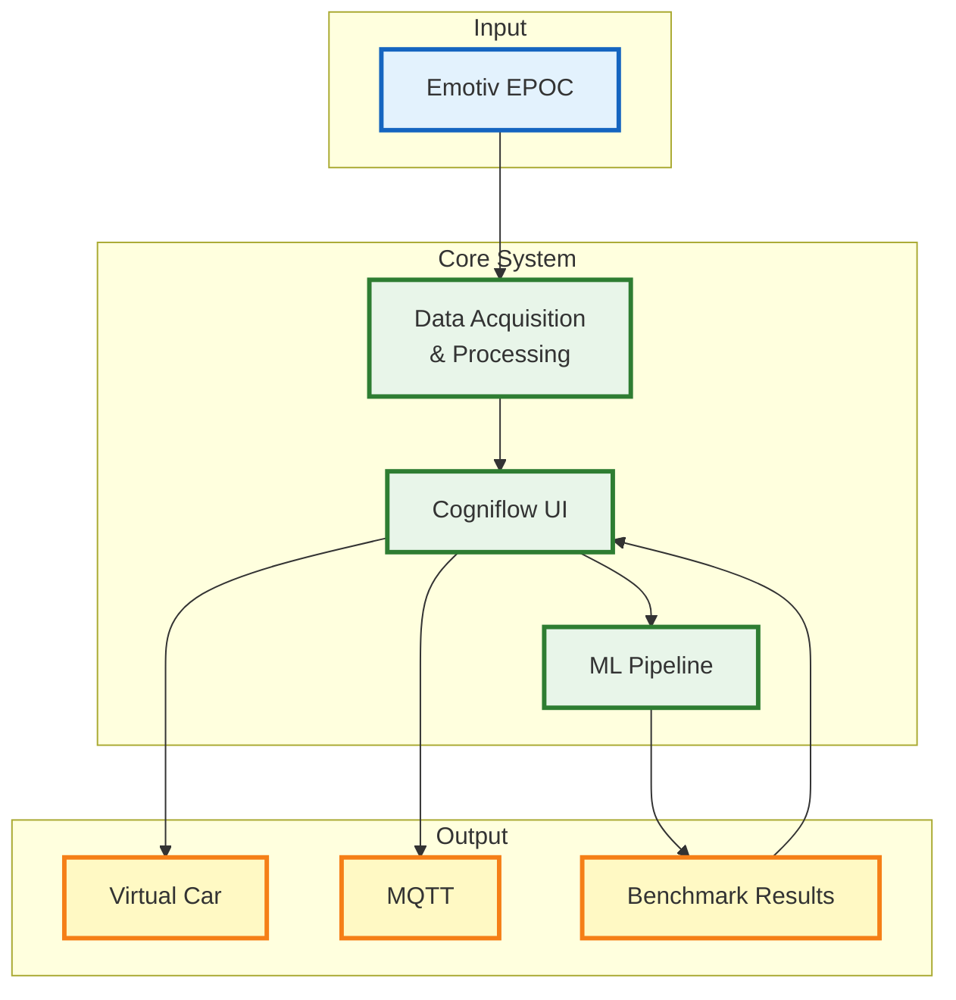

# Cogniflow Simplified High-Level Architecture



## System Overview

Cogniflow is a Brain-Computer Interface (BCI) system that enables EEG-based control of a virtual car.

### Core Components

1. **Input Sources**
   - **Emotiv EPOC**: Real EEG headset providing 14-channel brain signals
   - **Dummy Device**: Simulated EEG data for testing without hardware

2. **Core System**
   - **BCI Engine**: Processes EEG data from hardware or simulation
   - **Trainer UI**: Pygame-based interface for calibration, recording, and control
   - **ML Pipeline**: Automated machine learning workflow for model training

3. **Output Destinations**
   - **Driving Control**: Real-time car control using BCI predictions
   - **MQTT Output**: External device control via MQTT messaging
   - **Results & Models**: Storage and export of trained models and analysis results

### Data Flow

```
EEG Input → BCI Processing → User Interface → Control Output
                                      ↓
                                   ML Training → Models → Results
```

### Key Features

- **Real-time BCI Control**: EEG signals directly control virtual car movement
- **Training & Calibration**: Guided process to train ML models on user brain patterns
- **Flexible Input**: Works with real EEG hardware or simulated data
- **External Integration**: MQTT output for controlling external devices
- **Complete ML Pipeline**: End-to-end workflow from data collection to model deployment

