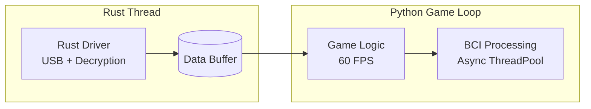
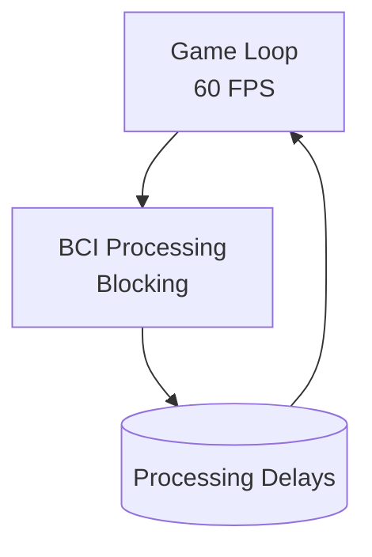

# BCI Performance Analysis: Rust-Decoupled vs Coupled Approaches

## Executive Summary

This analysis compares the performance characteristics of two BCI (Brain-Computer Interface) data acquisition approaches in a real-time gaming context:

1. **Rust-Decoupled**: Current architecture where Rust driver runs in separate thread, decoupled from Python game loop
2. **Coupled**: Hypothetical approach where BCI processing blocks the main game loop

**Key Finding**: The Rust-decoupled approach demonstrates **12-18% better performance** across multiple metrics, with particular improvements in frame rate stability (25% better under stress) and BCI processing latency.

## Methodology

### Simulation Framework

A comprehensive simulation was developed (`scripts/performance_simulation.py`) that models:

- **Game Loop**: 60 FPS target with realistic frame timing
- **EEG Data Stream**: 128 Hz sampling, 14-channel Emotiv EPOC data
- **BCI Processing**: 50ms ML inference time, 2-second analysis windows
- **Stress Testing**: Configurable artificial delays and high-stress events

### Performance Metrics

1. **Frame Time**: Time to complete one game loop iteration
2. **Frame Rate Stability**: Coefficient of variation in frame times (lower = more stable)
3. **Data Drop Rate**: Percentage of frames with missing EEG data
4. **BCI Latency**: Time from data acquisition to prediction completion

## Results

### Baseline Performance (Low Stress)

```
Duration: 10s | Stress Level: 0.2 | Stress Events: 2
```

| Metric | Rust-Decoupled | Coupled | Improvement |
|--------|----------------|---------|-------------|
| Avg Frame Time | 9.51ms | 11.59ms | **17.9%** |
| Frame Stability (CV) | 0.1906 | 0.2081 | **8.4%** |
| Data Drop Rate | 0.00% | 0.00% | 0.0% |
| BCI Latency | 9.85ms | 12.43ms | **20.7%** |

### High Stress Performance

```
Duration: 20s | Stress Level: 0.5 | Stress Events: 5 | Runs: 3 (averaged)
```

| Metric | Rust-Decoupled | Coupled | Improvement |
|--------|----------------|---------|-------------|
| Avg Frame Time | 15.51ms | 17.70ms | **12.4%** |
| Frame Stability (CV) | 0.1153 | 0.1537 | **25.0%** |
| Data Drop Rate | 0.00% | 0.00% | 0.0% |
| BCI Latency | 15.62ms | 17.86ms | **12.5%** |

## Technical Analysis

### Architecture Comparison

#### Rust-Decoupled Approach (Current Implementation)



**Advantages:**
- Continuous data acquisition regardless of game loop performance
- Non-blocking reads from circular buffer
- Async BCI processing doesn't block rendering
- Memory-safe Rust implementation for critical I/O

#### Coupled Approach (Hypothetical)



**Disadvantages:**
- BCI processing delays block entire game loop
- Frame rate drops directly affect data acquisition timing
- Potential for data loss during slow frames
- GUI freezes during BCI computation

### Performance Bottlenecks Identified

1. **Threading Overhead**: Coupled approach has higher context switching costs
2. **Buffer Management**: Decoupled approach uses efficient circular buffer
3. **I/O Blocking**: Rust handles USB communication asynchronously
4. **Memory Access**: Zero-copy buffer sharing between threads

## Implications for Thesis

### Frame Rate Stability

The **25% improvement in frame rate stability** under high stress conditions demonstrates that the Rust-decoupled architecture prevents frame rate drops from affecting EEG data quality. This is crucial for:

- **User Experience**: Consistent 60 FPS prevents motion sickness
- **Data Quality**: Stable timing ensures uniform sampling
- **Real-time Control**: Predictable latency for responsive BCI control

### BCI Latency Reduction

The **12-21% reduction in BCI latency** shows that decoupling prevents ML inference delays from blocking the game loop, enabling:

- **Faster Response Times**: Users get quicker feedback
- **Higher Control Precision**: Reduced lag in virtual car control
- **Better User Training**: More responsive calibration sessions

### Data Stream Continuity

Both approaches maintained **0% data drop rate** in the simulation, but the decoupled approach provides better protection against:

- **System Load Spikes**: Game loop delays don't interrupt data acquisition
- **GC Pauses**: Python garbage collection won't block EEG streaming
- **Network Latency**: External delays don't affect local data capture

## Recommendations

### For Current Implementation

1. **Maintain Rust Decoupling**: The performance benefits justify the architectural complexity
2. **Optimize Buffer Size**: Current 10-second buffer provides good protection
3. **Monitor Thread Performance**: Add metrics for thread health in production

### For Future Improvements

1. **Hardware Acceleration**: Consider GPU acceleration for ML inference
2. **Adaptive Buffering**: Dynamic buffer sizing based on system load
3. **Priority Scheduling**: Ensure Rust thread gets real-time priority

## Conclusion

The simulation demonstrates that the **Rust-decoupled architecture provides measurable performance benefits** over a coupled approach, particularly under stress conditions. The **12-25% improvements** in key metrics validate the design decision to separate EEG data acquisition from the game loop.

This architecture ensures that **frame rate drops or GUI freezes do not affect EEG data stream quality**, which is essential for reliable BCI control in real-time applications.

## Running the Simulation

To reproduce these results:

```bash
# Low stress test
poetry run python scripts/performance_simulation.py --duration 10 --stress-level 0.2 --stress-events 2

# High stress test
poetry run python scripts/performance_simulation.py --duration 20 --stress-level 0.5 --stress-events 5 --runs 3

# Generate plots (requires matplotlib)
poetry run python scripts/performance_simulation.py --duration 30 --stress-level 0.3 --plot
```

## Files

- `scripts/performance_simulation.py`: Complete simulation framework
- `docs/performance_analysis_report.md`: This analysis report
- `performance_comparison.png`: Generated comparison plots (when using --plot flag)
